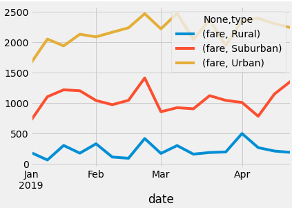

# PyBer_Analysis
# Overview of the analysis:
The purpose of this analysis is to review the ride-sharing data of three different types of cities.  By comparing the fare amounts and average driver count we can make recommendations to improve the quality of service and quantity of drivers where needed.  
# Results: Using images from the summary DataFrame and multiple-line chart, describe the differences in ride-sharing data among the different city types.

- As you can see in the dataframe above, there is significantly more activity in the Urban area than the other city types.  There is a relation between the amount of total rides and the total fares for each city.  The average fare per ride increases when there are less drivers competing for the same compensation. 
- Below we observe that there is a minimum amount that each city makes regardless of the time of year.  Rural areas generate the least amount of revenue for the ride-sharing platform.  

# Summary:   
1. Certain cities have siginficantly low driver counts in order to increase these numbers we should provide bonus incentives for drivers to join the platform.  
2. There are more drivers than are required in the Urban areas.  We should take drivers off the platform if they have not provided rides to clients within three months.  
3. We should provide discounts or promotions to the Suburban and Rural areas as their total rides are less than half of the Urban city rides. 
